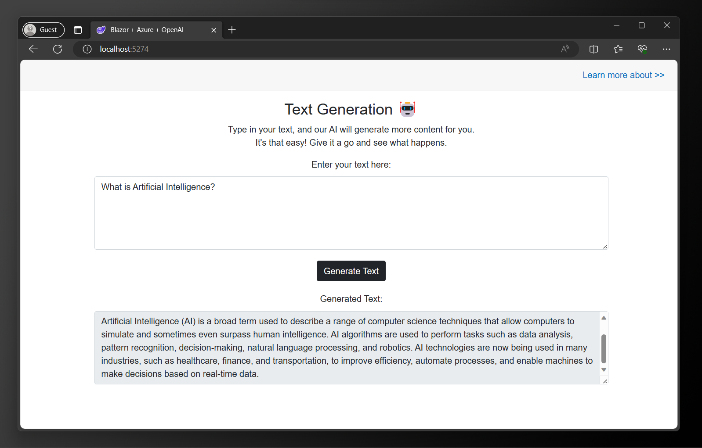

# Blazor + Azure + OpenAI

This is a sample text generation app using OpenAI's GPT-3 API. It's built with Blazor WebAssembly and hosted on Azure Static Web Apps.

## Screenshot



## How to run

1. Clone this repo
2. Create `appsettings.json` file in the root directory [wwwroot](./Blazor-Azure-OpenAI/wwwroot/) with the following content:

   - Location of the file: [wwwroot/appsettings.json](./Blazor-Azure-OpenAI/wwwroot/appsettings.json)

   - Content of the file:

   ```json
   {
     "SecretKeys": {
       "APIKey": "sk-****************************"
     }
   }
   ```

3. Change the directory to [Blazor-Azure-OpenAI](./Blazor-Azure-OpenAI/) and run `dotnet restore` to install the dependencies (only required for the first time)

   ```bash
    cd Blazor-Azure-OpenAI
    dotnet restore
   ```

4. Run the app with:
   - `dotnet run`: for development
   - `dotnet run watch`: for development with hot reload
   - `dotnet publish`: for production
5. Open the app in your browser at `https://localhost:[port]`
   - The port will be displayed in the terminal
   - Find the `launchSettings.json` file in the [Properties](./Blazor-Azure-OpenAI/Properties/) folder to change the port
